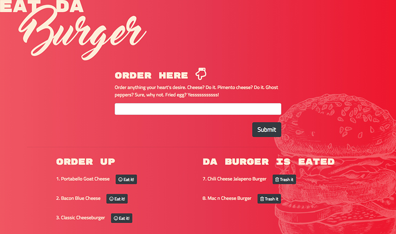

# Eat da Burger

### What is this?

Eat da Burger is a restaurant ordering app using MySQL, Node, Express, Handlebars, and ORM.

### How does it work?

Using the form under "Order Here," users input the names of burgers they'd like to eat. Once the burger is submitted, it is sent to the "Order Up" area and stored in the database. Clicking the "Eat It!" button sends the burger to "Da Burger Is Eated" area where the user can then "Trash It," resulting in the burger being deleted from the database.

View the app here: https://polar-springs-40578.herokuapp.com/

### Screenshots

### Technologies Applied

* HTML
* Bootstrap/CSS
* Heroku
* node.js
* JavaScript
* MySQL
* ORM
* Express (https://www.npmjs.com/package/express)
* Handlebars (https://www.npmjs.com/package/handlebars)
* Body Parser (https://www.npmjs.com/package/body-parser)